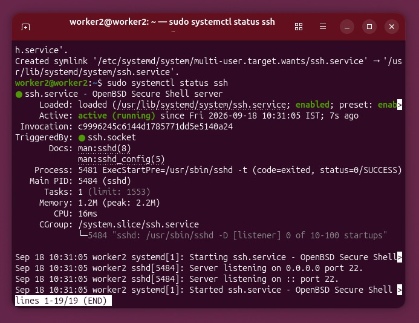
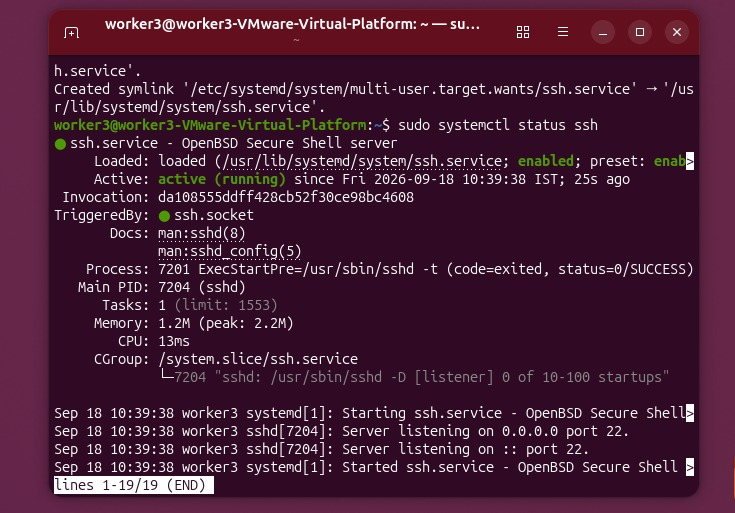
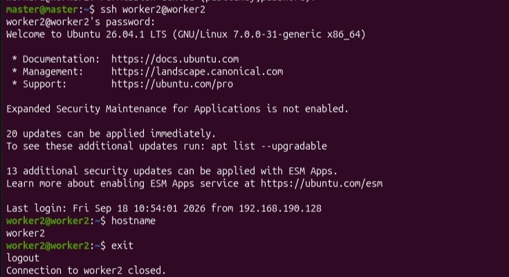

# 🌐 Part C: MPI Distributed-Memory Matrix Multiplication

[](#)
[](#)
[](#)

---

## 🔬 1. In-Depth Theoretical Principles of MPI

### 🌐 The Message Passing Model & Shared-Nothing Architecture
In **Distributed-Memory Computing (MIMD)**, nodes do not share physical memory or a common clock. Instead, every process has a strictly isolated local memory space and communicates explicitly over a network interface via standard message passing protocols:

```text
               ┌───────────────────────────────┐
               │    MASTER NODE (Rank 0)       │
               │   Distributes Row Partitions  │
               └───────────────┬───────────────┘
                               │ (TCP/IP Network Fabric)
         ┌─────────────────────┼─────────────────────┐
         ▼                     ▼                     ▼
┌─────────────────┐   ┌─────────────────┐   ┌─────────────────┐
│ WORKER 1        │   │ WORKER 2        │   │ WORKER 3        │
│ (Rank 1)        │   │ (Rank 2)        │   │ (Rank 3)        │
│ Computes Slice 1│   │ Computes Slice 2│   │ Computes Slice 3│
└─────────────────┘   └─────────────────┘   └─────────────────┘
```

---

### 📦 2. Domain Decomposition & Communication Analysis

#### A. 1D Block Row Decomposition
The $N \times N$ output matrix $C$ is partitioned along the outer row dimension across $W = 3$ worker processes:

$$\text{Rows per Worker} \approx \left\lfloor \frac{N}{W} \right\rfloor = \left\lfloor \frac{4000}{3} \right\rfloor = 1333\text{ Rows}$$
$$\text{Remainder Partition (Rank 1): } 1334\text{ Rows}, \quad \text{Rank 2: } 1333\text{ Rows}, \quad \text{Rank 3: } 1333\text{ Rows}$$

#### B. Network Communication Latency & Overhead
Communication time across the cluster network is governed by:

$$T_{\text{comm}} = T_{\text{latency}} + \frac{\text{Data Transferred (Bytes)}}{\text{Network Bandwidth}}$$

- **Matrix $B$ Broadcast:** Full $4000 \times 4000 \times 8\text{ bytes} = 128\text{ MB}$ sent to each worker.
- **Matrix $A$ Slice:** $1333 \times 4000 \times 8\text{ bytes} \approx 42.6\text{ MB}$ sent per worker.
- **Matrix $C$ Result Return:** $\approx 42.6\text{ MB}$ received per worker back at Master Rank 0.

---

## 📸 3. Cluster Connectivity & Ping Verification (0% Packet Loss)

The Master VM verifies bidirectional TCP/IP network reachability to all three worker VMs:

<div align="center">
  
</div>

- **Worker 1 (`192.168.x.x`):** `0% packet loss` ✅
- **Worker 2 (`192.168.x.x`):** `0% packet loss` ✅
- **Worker 3 (`192.168.x.x`):** `0% packet loss` ✅

---

## 📸 4. OpenSSH Daemon Configuration on Worker Nodes

OpenSSH server service was configured and verified active across all cluster nodes:

| Worker 1 SSH Service | Worker 2 SSH Service | Worker 3 SSH Service |
| :---: | :---: | :---: |
|  |  |  |
| `Active (running)` ✅ | `Active (running)` ✅ | `Active (running)` ✅ |

---

## 📸 5. SSH Remote Hostname & Connection Verification

The Master node securely accesses and coordinates each worker VM via key-based SSH:

| Master ➔ Worker 1 SSH Trace | Master ➔ Worker 2 SSH Trace | Master ➔ Worker 3 SSH Trace |
| :---: | :---: | :---: |
|  |  |  |
| `Connected to Worker 1` ✅ | `Connected to Worker 2` ✅ | `Connected to Worker 3` ✅ |

---

## 💻 6. Complete MPI C Source Code (`matrix_mpi.c`)

```c
#include <stdio.h>
#include <stdlib.h>
#include <mpi.h>

#define N 4000
#define MASTER 0
#define FROM_MASTER 1
#define FROM_WORKER 2

int main(int argc, char *argv[]) {
    int numtasks, taskid, numworkers, source, dest, mtype, rows, averow, extra, offset;
    double *A = NULL, *B = NULL, *C = NULL;
    MPI_Status status;

    MPI_Init(&argc, &argv);
    MPI_Comm_rank(MPI_COMM_WORLD, &taskid);
    MPI_Comm_size(MPI_COMM_WORLD, &numtasks);

    if (numtasks < 2) {
        if (taskid == MASTER) printf("Error: Need at least 2 MPI processes.\n");
        MPI_Finalize();
        return 1;
    }

    numworkers = numtasks - 1;
    B = (double *)malloc((size_t)N * N * sizeof(double));

    /* ---------------- MASTER NODE ---------------- */
    if (taskid == MASTER) {
        A = (double *)malloc((size_t)N * N * sizeof(double));
        C = (double *)malloc((size_t)N * N * sizeof(double));

        for (int i = 0; i < N; i++) {
            for (int j = 0; j < N; j++) {
                A[i * N + j] = 1.0;
                B[i * N + j] = 1.0;
                C[i * N + j] = 0.0;
            }
        }

        double start = MPI_Wtime();
        averow = N / numworkers;
        extra = N % numworkers;
        offset = 0;

        for (dest = 1; dest <= numworkers; dest++) {
            rows = (dest <= extra) ? averow + 1 : averow;
            MPI_Send(&offset, 1, MPI_INT, dest, FROM_MASTER, MPI_COMM_WORLD);
            MPI_Send(&rows, 1, MPI_INT, dest, FROM_MASTER, MPI_COMM_WORLD);
            MPI_Send(&A[offset * N], rows * N, MPI_DOUBLE, dest, FROM_MASTER, MPI_COMM_WORLD);
            MPI_Send(B, N * N, MPI_DOUBLE, dest, FROM_MASTER, MPI_COMM_WORLD);
            offset += rows;
        }

        for (int i = 1; i <= numworkers; i++) {
            source = i;
            MPI_Recv(&offset, 1, MPI_INT, source, FROM_WORKER, MPI_COMM_WORLD, &status);
            MPI_Recv(&rows, 1, MPI_INT, source, FROM_WORKER, MPI_COMM_WORLD, &status);
            MPI_Recv(&C[offset * N], rows * N, MPI_DOUBLE, source, FROM_WORKER, MPI_COMM_WORLD, &status);
        }

        double end = MPI_Wtime();
        printf("\nMPI Distributed Matrix Multiplication Completed\n");
        printf("Matrix Size = %d x %d | Total MPI Processes = %d\n", N, N, numtasks);
        printf("Execution Time = %f seconds\n", end - start);
        printf("Verification C[0][0] = %.2f\n", C[0]);

        free(A); free(C);
    }

    /* ---------------- WORKER NODES ---------------- */
    if (taskid > MASTER) {
        MPI_Recv(&offset, 1, MPI_INT, MASTER, FROM_MASTER, MPI_COMM_WORLD, &status);
        MPI_Recv(&rows, 1, MPI_INT, MASTER, FROM_MASTER, MPI_COMM_WORLD, &status);

        double *sub_A = (double *)malloc((size_t)rows * N * sizeof(double));
        double *sub_C = (double *)malloc((size_t)rows * N * sizeof(double));

        MPI_Recv(sub_A, rows * N, MPI_DOUBLE, MASTER, FROM_MASTER, MPI_COMM_WORLD, &status);
        MPI_Recv(B, N * N, MPI_DOUBLE, MASTER, FROM_MASTER, MPI_COMM_WORLD, &status);

        for (int i = 0; i < rows; i++) {
            for (int j = 0; j < N; j++) {
                double sum = 0.0;
                for (int k = 0; k < N; k++) {
                    sum += sub_A[i * N + k] * B[k * N + j];
                }
                sub_C[i * N + j] = sum;
            }
        }

        MPI_Send(&offset, 1, MPI_INT, MASTER, FROM_WORKER, MPI_COMM_WORLD);
        MPI_Send(&rows, 1, MPI_INT, MASTER, FROM_WORKER, MPI_COMM_WORLD);
        MPI_Send(sub_C, rows * N, MPI_DOUBLE, MASTER, FROM_WORKER, MPI_COMM_WORLD);

        free(sub_A); free(sub_C);
    }

    free(B);
    MPI_Finalize();
    return 0;
}
```

---

[⬅️ Return to Main README](README.md)
