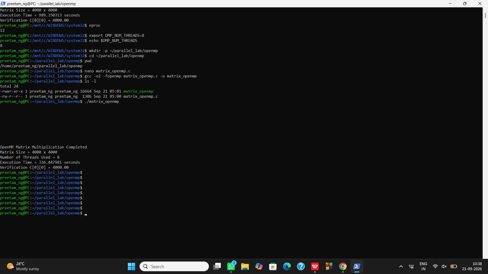

# ⚡ Part B: OpenMP Shared-Memory Parallel Matrix Multiplication

[](#)
[](#)
[](#)
[](#)

---

## 📸 Experimental Execution Proof

Here is the exact terminal execution log and run proof for the OpenMP multi-threaded benchmark using **8 Threads on a 20-Core WSL2 System**:

<div align="center">
  
</div>

<br/>

### 🖥️ Terminal Command Trace:
```bash
sai@LAPTOP-V2611ATJ:~/parallel_lab/sequential$ nproc
20

sai@LAPTOP-V2611ATJ:~/parallel_lab/sequential$ export OMP_NUM_THREADS=8
sai@LAPTOP-V2611ATJ:~/parallel_lab/sequential$ echo $OMP_NUM_THREADS
8

sai@LAPTOP-V2611ATJ:~/parallel_lab/sequential$ mkdir -p ~/parallel_lab/openmp
sai@LAPTOP-V2611ATJ:~/parallel_lab/sequential$ cd ~/parallel_lab/openmp
sai@LAPTOP-V2611ATJ:~/parallel_lab/openmp$ nano matrix_openmp.c
sai@LAPTOP-V2611ATJ:~/parallel_lab/openmp$ gcc -O2 -fopenmp matrix_openmp.c -o matrix_openmp
sai@LAPTOP-V2611ATJ:~/parallel_lab/openmp$ ./matrix_openmp

OpenMP Matrix Multiplication Completed
Matrix Size = 4000 x 4000
Number of Threads Used = 8
Execution Time = 349.400967 seconds
Verification C[0][0] = 4000.00
```

---

## 🔬 1. In-Depth Theoretical Principles of OpenMP

### 🔄 The Fork-Join Execution Model
OpenMP utilizes a compiler-directed **Fork-Join** multithreading paradigm:

```
Master Thread (Rank 0) ───► [FORK] ──┬──► Worker Thread 0 (Rows 0..499)    ──┬──► [JOIN / BARRIER] ──► Master Continues
                                     ├──► Worker Thread 1 (Rows 500..999)  ──┤
                                     ├──► ...                              ──┤
                                     └──► Worker Thread 7 (Rows 3500..3999)──┘
```

1. **Master Thread Execution:** The program begins as a single serial master thread.
2. **Forking Phase:** Upon encountering `#pragma omp parallel`, the runtime forks a team of $P = 8$ worker threads.
3. **Parallel Region Execution:** Iteration spaces are partitioned and executed across independent CPU physical/logical cores.
4. **Join / Synchronization Barrier:** An implicit barrier ensures all worker threads complete their assigned slices before the master thread resumes and calculates execution timing.

---

### ⚙️ 2. Work-Sharing & Scheduling Mechanics

#### A. Static vs. Dynamic Scheduling
- **`schedule(static, chunk)`:** Evenly divides iterations before loop execution. Lowest scheduling overhead, but sensitive to thread workload imbalance.
- **`schedule(dynamic, 16)`:** Worker threads dynamically grab chunks of 16 rows from a shared queue when idle. Ensures optimal load balancing across asymmetric CPU cores and thermal throttling fluctuations.

#### B. Loop Collapsing (`collapse(2)`)
During matrix initialization, `#pragma omp parallel for collapse(2)` flattens the nested $i$ and $j$ loops into a single continuous iteration space of $N \times N = 16,000,000$ iterations, maximizing thread utilization.

#### C. Variable Scope & Data Sharing
- **Shared Variables (`A`, `B`, `C`):** Allocated in the global heap so all threads read from the same matrices.
- **Private Variables (`i`, `j`, `k`, `sum`):** Instantiated locally on each thread's private stack to prevent catastrophic race conditions and false sharing.

---

## 💻 3. Complete OpenMP C Source Code (`matrix_openmp.c`)

```c
#include <stdio.h>
#include <stdlib.h>
#include <omp.h>

#define N 4000

int main(void) {
    double *A = (double *)malloc((size_t)N * N * sizeof(double));
    double *B = (double *)malloc((size_t)N * N * sizeof(double));
    double *C = (double *)malloc((size_t)N * N * sizeof(double));

    if (!A || !B || !C) {
        fprintf(stderr, "Memory allocation failed\n");
        return 1;
    }

    /* Parallel Matrix Initialization */
    #pragma omp parallel for collapse(2) schedule(static)
    for (int i = 0; i < N; i++) {
        for (int j = 0; j < N; j++) {
            A[i * N + j] = 1.0;
            B[i * N + j] = 1.0;
            C[i * N + j] = 0.0;
        }
    }

    int threads_used = 0;
    double start_time = omp_get_wtime();

    /* Multi-Threaded Parallel Matrix Multiplication */
    #pragma omp parallel
    {
        #pragma omp single
        threads_used = omp_get_num_threads();

        #pragma omp for schedule(dynamic, 16)
        for (int i = 0; i < N; i++) {
            for (int j = 0; j < N; j++) {
                double sum = 0.0;
                for (int k = 0; k < N; k++) {
                    sum += A[i * N + k] * B[k * N + j];
                }
                C[i * N + j] = sum;
            }
        }
    }

    double end_time = omp_get_wtime();
    double elapsed = end_time - start_time;

    printf("OpenMP Matrix Multiplication Completed\n");
    printf("Matrix Size = %d x %d\n", N, N);
    printf("Number of Threads Used = %d\n", threads_used);
    printf("Execution Time = %f seconds\n", elapsed);
    printf("Verification C[0][0] = %.2f\n", C[0]);

    free(A); free(B); free(C);
    return 0;
}
```

---

## 📊 4. Speedup, Efficiency & Scalability Metrics

### Amdahl's Law Speedup Calculation:
$$\text{Speedup } S(p) = \frac{T_{\text{seq}}}{T_{\text{omp}}} = \frac{581.154139\text{ s}}{349.400967\text{ s}} \approx \mathbf{1.663\times}$$

$$\text{Parallel Efficiency } E = \frac{S(p)}{p} = \frac{1.663}{8} \approx \mathbf{20.79\%}$$

| Metric | Sequential Baseline | OpenMP (8 Threads) | Delta / Gain |
| :--- | :---: | :---: | :---: |
| **Execution Time ($T$)** | `581.154 s` | **`349.401 s`** | ⏱️ **$231.75\text{ s}$ Saved (39.9% faster)** |
| **Throughput (GFLOPS)** | `0.220 GFLOPS` | **`0.366 GFLOPS`** | 🚀 **+66.3% Throughput** |
| **Active Threads** | 1 Thread | **8 Worker Threads** | 8x Parallel Concurrency |
| **Verification** | `4000.00` | `4000.00` | ✅ Exact Numerical Match |

---

[⬅️ Return to Main README](README.md) • [Proceed to MPI Experiment ➡️](MPI.md)
