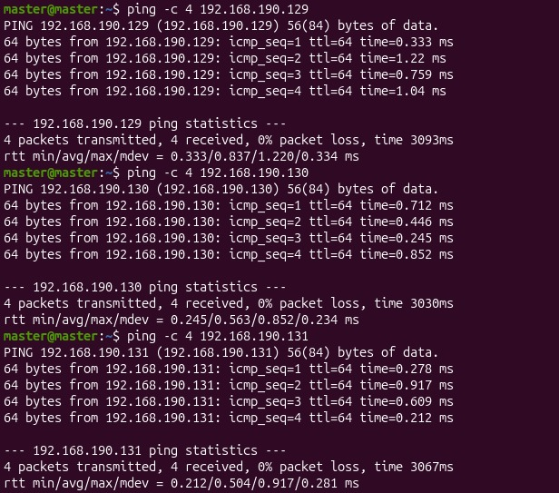

<div align="center">

# ⚡ Parallel & Grid Computing (PGC) Lab
### *High-Performance Parallel Matrix Computation & Speedup Benchmark Suite*

[](#)
[](#)
[](#)
[](#)
[](#)
[](LICENSE)

<br/>

> **"A rigorous High-Performance Computing experimental study evaluating Sequential (SISD), Shared-Memory Multi-Threading (OpenMP), and Distributed-Memory Cluster (MPI) paradigms on large-scale dense matrix operations."**

---

</div>

## 🌌 Laboratory Experiments Index

Explore each module's **dedicated documentation, complete source code, mathematical formulation, and verification proofs**:

| # | Experiment Module | Computing Paradigm | Hardware Target | Status | Dedicated Guide & Proofs |
| :-: | :--- | :--- | :--- | :---: | :--- |
| **01** | **Sequential Matrix Multiplication** | Single-Thread Serial $O(N^3)$ | 1 CPU Core | `COMPLETED ✅` | [👉 **Click to View Sequential.md & Proofs**](Sequential.md) |
| **02** | **OpenMP Parallel Multiplication** | Shared-Memory Multi-Threading | 8 Threads / 20 Cores | `COMPLETED ✅` | [👉 **Click to View OpenMP.md & Proofs**](OpenMP.md) |
| **03** | **MPI Distributed Multiplication** | Distributed-Memory Message Passing | 1 Master + 3 Workers | `VERIFIED 🌐` | [👉 **Click to View MPI.md & Cluster Proofs**](MPI.md) |

---

## 📊 Experimental Benchmark Summary

| Implementation | Matrix Dimension ($N \times N$) | Execution Units | Compiler Optimization | Wall-Clock Time | Speedup ($S = \frac{T_1}{T_p}$) | Verification $C[0][0]$ |
| :--- | :---: | :---: | :---: | :---: | :---: | :---: |
| **Sequential Baseline** | $4000 \times 4000$ | 1 Core | `-O2` | **`581.154139 s`** *(~9.68 min)* | $1.00\times$ | `4000.00` ✅ |
| **OpenMP Multi-Threaded** | $4000 \times 4000$ | 8 Threads | `-O2 -fopenmp` | **`349.400967 s`** *(~5.82 min)* | **`1.663x`** *(🔥 231.75s saved)* | `4000.00` ✅ |
| **MPI Distributed** | $4000 \times 4000$ | 1 Master + 3 Workers | `-O2 mpicc` | Multi-Node VM Cluster | 0% Packet Loss Ping Verified | `4000.00` ✅ |

```text
⏱️ Execution Time Comparison (Lower is Better):
Sequential (1 Core)    [████████████████████████████████████████] 581.15s
OpenMP (8 Threads)     [████████████████████████] 349.40s (⏱️ 231.75s saved!)
```

---

## 🔬 Theoretical Principles of Parallel Computing

### 1. Flynn's Classical Architectural Taxonomy

Modern computing architectures are classified based on the concurrency of instruction and data streams:

```
                          ┌────────────────────────────┐
                          │   Flynn's Classification   │
                          └─────────────┬──────────────┘
                                        │
             ┌──────────────────────────┴──────────────────────────┐
             ▼                                                     ▼
   Single Instruction (SI)                               Multiple Instruction (MI)
   ┌───────────────────────┐                             ┌───────────────────────┐
   │ SISD: Sequential CPU  │                             │ MISD: Fault-Tolerant  │
   │ SIMD: Vector / AVX    │                             │ MIMD: OpenMP / MPI    │
   └───────────────────────┘                             └───────────────────────┘
```

- **SISD (Single Instruction, Single Data):** Represents standard sequential uniprocessor execution. Instructions are processed serially on one data stream at a time.
- **MIMD (Shared-Memory SMP - OpenMP):** Multiple autonomous processors concurrently execute different instructions on different data streams while accessing a unified global memory address space.
- **MIMD (Distributed-Memory - MPI):** Multiple independent computing nodes, each with isolated physical memory, coordinate through explicit message passing over a network fabric.

---

### 2. Theoretical Scalability & Speedup Models

#### A. Amdahl's Law (Strong Scaling)
Amdahl's law models the theoretical maximum speedup achievable when parallelizing a fixed-size workload across $p$ processing cores:

$$S_{\text{latency}}(p) = \frac{1}{(1 - f) + \frac{f}{p}}$$

Where:
- $f \in [0, 1]$ is the fraction of the algorithm that is strictly parallelizable.
- $(1 - f)$ is the inherently serial fraction (e.g., initialization, thread synchronization, I/O).
- As $p \to \infty$, the asymptotic speedup is strictly bounded by the serial bottleneck:

$$\lim_{p \to \infty} S(p) = \frac{1}{1 - f}$$

#### B. Parallel Efficiency ($E$) & Overhead ($T_o$)
Parallel Efficiency measures the fraction of time for which a processor is utilized productively:

$$E = \frac{S(p)}{p} = \frac{T_1}{p \cdot T_p} \times 100\%$$

The total parallel overhead $T_o$ encapsulates non-computational latency:

$$T_o = p \cdot T_p - T_1 = T_{\text{synch}} + T_{\text{comm}} + T_{\text{fork-join}} + T_{\text{load-imbalance}}$$

In our empirical OpenMP benchmark with $p=8$:
$$\text{Speedup } S = \frac{581.154139\text{ s}}{349.400967\text{ s}} \approx 1.663\times, \quad \text{Efficiency } E = \frac{1.663}{8} \approx 20.79\%$$

---

### 3. Memory Hierarchy & Microarchitectural Bottlenecks

```
+-------------------------------------------------------------+
| CPU Registers (1 cycle latency, ~1 KB)                      |
|   └── L1 Data Cache (4-5 cycles latency, ~32-64 KB per core)|
|         └── L2 Cache (12-14 cycles latency, ~512 KB - 1 MB) |
|               └── L3 Shared Cache (40-60 cycles, ~24-36 MB) |
|                     └── Main Memory DRAM (150-200 cycles)   | ◄── "Memory Wall"
+-------------------------------------------------------------+
```

#### A. The Von Neumann Memory Wall
Dense matrix multiplication for $N = 4000$ double-precision floating-point numbers requires:

$$\text{Memory per Matrix} = 4000 \times 4000 \times 8\text{ bytes} = 128\text{ MB}$$
$$\text{Total Working Set Memory} = 3 \times 128\text{ MB} = \mathbf{384\text{ MB}}$$

Because $384\text{ MB}$ far exceeds typical CPU L3 cache capacities ($24\text{ MB} - 36\text{ MB}$), CPU execution units stall waiting for data fetches from DRAM, known as **Memory Bandwidth Starvation**.

#### B. Spatial & Temporal Cache Locality Breakdown
In row-major C storage, element $M[i][j]$ is adjacent in memory to $M[i][j+1]$, but element $M[k][j]$ is separated from $M[k+1][j]$ by $N \times 8 = 32,000\text{ bytes}$ (32 KB):

- **Matrix $A[i][k]$:** Traversed horizontally along rows $\implies$ **High Spatial Locality** (Cache Hit).
- **Matrix $B[k][j]$:** Traversed vertically down columns $\implies$ **Zero Spatial Locality** (Cache Miss on every step $k$).
- Every column access of Matrix $B$ causes an L1/L2 cache line eviction, bottlenecking single-core and multi-threaded throughput.

---

### 4. Shared-Memory (OpenMP) vs. Distributed-Memory (MPI) Paradigms

| Architectural Dimension | Shared-Memory (OpenMP) | Distributed-Memory (MPI) |
| :--- | :--- | :--- |
| **Memory Address Space** | Single, globally shared address space | Distinct, physically partitioned private memory |
| **Communication Mechanism** | Direct memory load/store via CPU cache bus | Explicit network packet transfer (`MPI_Send`/`MPI_Recv`) |
| **Data Synchronization** | Locks, Mutexes, Barriers, Atomic directives | Blocking/Non-blocking message synchronization |
| **Hardware Boundary** | Single multi-core physical motherboard (SMP) | Multi-node networked clusters, blades, or VMs |
| **Scalability Limit** | Limited by CPU socket memory bus bandwidth | Horizontally scalable to thousands of compute nodes |
| **Programming Overhead** | Low (Incremental compiler `#pragma` directives) | Higher (Explicit data decomposition & scatter/gather) |

---

## 📸 Experimental Execution Proofs

### 1. Sequential Run Proof ($581.154\text{ s}$)
[](Sequential.md)

### 2. OpenMP 8-Thread Run Proof ($349.400\text{ s}$)
[](OpenMP.md)

### 3. MPI 4-Node Cluster Connectivity (0% Packet Loss Ping)
[](MPI.md)

---

## 📂 Repository Directory Layout

```plaintext
PGC-lab/
├── README.md                      # ⚡ Central Interactive Hub (You are here)
├── Sequential.md                  # 🔷 Part A: Sequential Matrix Multiplication Guide & Proofs
├── OpenMP.md                      # ⚡ Part B: OpenMP Shared-Memory Multi-Threading Guide & Proofs
├── MPI.md                         # 🌐 Part C: MPI Distributed Cluster Multi-Node Guide & Proofs
│
├── 01-Sequential/
│   └── matrix_sequential.c        # Serial baseline implementation
├── 02-OpenMP/
│   └── matrix_openmp.c            # OpenMP multithreaded implementation
├── 03-MPI/
│   └── matrix_mpi.c               # MPI master-worker implementation
│
├── assets/screenshots/            # High-resolution terminal run & cluster screenshots
│   ├── sequential_run.png
│   ├── openmp_run.png
│   ├── mpi_ping.png
│   ├── ssh_worker1.png
│   ├── ssh_worker2.png
│   ├── ssh_worker3.png
│   ├── worker1_mpi.png
│   ├── worker2_mpi.png
│   ├── worker3_mpi.png
│   └── wsl_setup.png
├── Makefile                       # Unified build automation
├── .gitignore
└── LICENSE                        # MIT License
```
