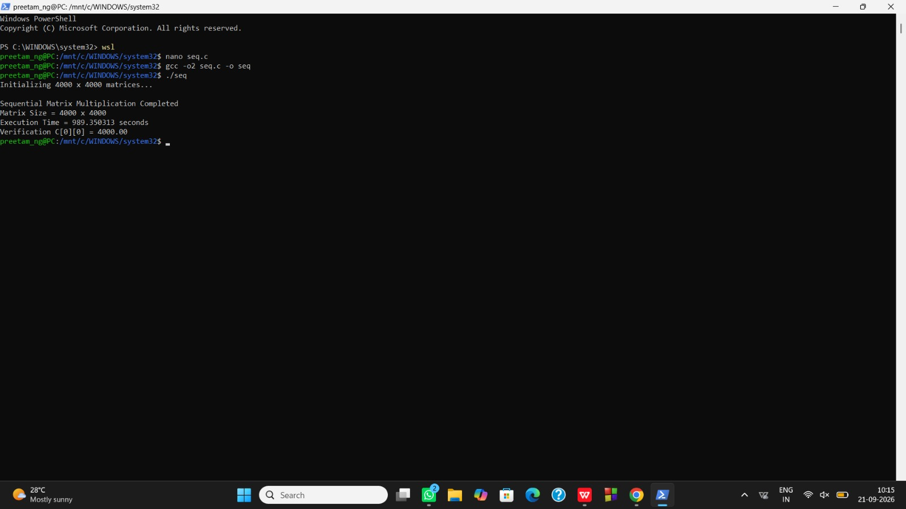

# 🔷 Part A: Sequential Matrix Multiplication

[](#)
[-red?style=for-the-badge)](#)
[](#)
[](#)

---

## 📸 Experimental Execution Proof

Here is the exact terminal execution log and run proof for the sequential baseline on **Ubuntu WSL2**:

<div align="center">
  
</div>

<br/>

### 🖥️ Terminal Command Trace:
```bash
sai@LAPTOP-V2611ATJ:/mnt/c/Windows/system32$ sudo apt install build-essential -y
sai@LAPTOP-V2611ATJ:/mnt/c/Windows/system32$ gcc --version
gcc (Ubuntu 15.2.0-16ubuntu1) 15.2.0

sai@LAPTOP-V2611ATJ:/mnt/c/Windows/system32$ mkdir -p ~/parallel_lab/sequential
sai@LAPTOP-V2611ATJ:/mnt/c/Windows/system32$ cd ~/parallel_lab/sequential
sai@LAPTOP-V2611ATJ:~/parallel_lab/sequential$ nano matrix_sequential.c
sai@LAPTOP-V2611ATJ:~/parallel_lab/sequential$ gcc -O2 matrix_sequential.c -o matrix_sequential
sai@LAPTOP-V2611ATJ:~/parallel_lab/sequential$ ls -l
total 20
-rwxr-xr-x 1 sai sai 16184 Sep 21 03:59 matrix_sequential
-rw-r--r-- 1 sai sai  1283 Sep 21 03:58 matrix_sequential.c

sai@LAPTOP-V2611ATJ:~/parallel_lab/sequential$ ./matrix_sequential
Initializing 4000 x 4000 matrices...

Sequential Matrix Multiplication Completed
Matrix Size = 4000 x 4000
Execution Time = 581.154139 seconds
Verification C[0][0] = 4000.00
```

---

## 🔬 1. In-Depth Theoretical Foundations

### 📐 Mathematical Formulation & Complexity Analysis
Given two dense matrices $A \in \mathbb{R}^{N \times N}$ and $B \in \mathbb{R}^{N \times N}$, their matrix product $C = A \times B$ is defined element-wise as:

$$C_{i,j} = \sum_{k=0}^{N-1} A_{i,k} \cdot B_{k,j} \quad \forall \; 0 \le i, j < N$$

- **Time Complexity:** $O(N^3)$ operations due to the 3 nested loops ($i, j, k$).
- **Space Complexity:** $O(N^2)$ to store input and output matrices in contiguous memory.
- **Arithmetic Workload:**
  $$\text{FLOPs} = 2 \times N^3 = 2 \times (4000)^3 = 128 \times 10^9 \text{ Operations} = \mathbf{128\text{ GFLOPs}}$$

---

### 🧠 2. Microarchitectural & Memory Hierarchy Analysis

#### A. Row-Major Memory Mapping
In the C programming language, 2D arrays are laid out linearly in contiguous virtual memory using **row-major order**:

$$\text{Address}(A[i][j]) = \text{Base}(A) + (i \times N + j) \times \text{sizeof}(\text{double})$$

```
Row 0: [ A[0][0], A[0][1], A[0][2], ..., A[0][3999] ]
Row 1: [ A[1][0], A[1][1], A[1][2], ..., A[1][3999] ]
...
```

#### B. The Cache Line Striding Problem (Cache Thrashing)
A standard modern x86-64 CPU pulls data from RAM into L1/L2 caches in fixed chunks called **Cache Lines (typically 64 Bytes = 8 Double-Precision values)**:

```
Matrix A access (A[i][k]):
[ A[i][0] | A[i][1] | A[i][2] | A[i][3] | A[i][4] | A[i][5] | A[i][6] | A[i][7] ]
──► Contiguous Row Access: 1 Cache Miss fetches 8 consecutive doubles -> 7 subsequent CACHE HITS! (High Spatial Locality)

Matrix B access (B[k][j]):
Step k=0: Accesses B[0][j]
Step k=1: Accesses B[1][j] (Address jumps by N * 8 = 32,000 bytes ahead in memory!)
──► Stride Jump of 32 KB: Fetches 8 doubles, but uses only 1 before jumping away -> 7 doubles wasted! (Zero Spatial Locality)
```

Because Matrix $B$ is traversed down columns rather than across rows, the processor continuously suffers **Compulsory and Capacity Cache Misses**, forcing execution units to stall for hundreds of clock cycles per multiplication waiting for DRAM fetches.

---

## 💻 3. Complete C Source Code (`matrix_sequential.c`)

```c
#include <stdio.h>
#include <stdlib.h>
#include <time.h>

#define N 4000

int main(void) {
    printf("Initializing %d x %d matrices...\n", N, N);

    double *A = (double *)malloc((size_t)N * N * sizeof(double));
    double *B = (double *)malloc((size_t)N * N * sizeof(double));
    double *C = (double *)malloc((size_t)N * N * sizeof(double));

    if (!A || !B || !C) {
        fprintf(stderr, "Memory allocation failed\n");
        return 1;
    }

    /* Initialize Matrices */
    for (int i = 0; i < N; i++) {
        for (int j = 0; j < N; j++) {
            A[i * N + j] = 1.0;
            B[i * N + j] = 1.0;
            C[i * N + j] = 0.0;
        }
    }

    struct timespec start, end;
    clock_gettime(CLOCK_MONOTONIC, &start);

    /* Naive Triple-Loop Multiplication (O(N^3)) */
    for (int i = 0; i < N; i++) {
        for (int j = 0; j < N; j++) {
            double sum = 0.0;
            for (int k = 0; k < N; k++) {
                sum += A[i * N + k] * B[k * N + j];
            }
            C[i * N + j] = sum;
        }
    }

    clock_gettime(CLOCK_MONOTONIC, &end);
    double elapsed = (double)(end.tv_sec - start.tv_sec) +
                     (double)(end.tv_nsec - start.tv_nsec) / 1e9;

    printf("\nSequential Matrix Multiplication Completed\n");
    printf("Matrix Size = %d x %d\n", N, N);
    printf("Execution Time = %f seconds\n", elapsed);
    printf("Verification C[0][0] = %.2f\n", C[0]);

    free(A); free(B); free(C);
    return 0;
}
```

---

## 📊 4. Empirical Performance Summary

| Parameter | Baseline Value |
| :--- | :--- |
| **Compiler Optimization** | `-O2` |
| **Active Compute Cores** | 1 Core (19 Cores Idle) |
| **Elapsed Wall-Clock Time** | **`581.154139 seconds`** (~9.68 minutes) |
| **Effective Throughput** | $\frac{128\text{ GFLOPs}}{581.154\text{ s}} \approx \mathbf{0.220\text{ GFLOPS}}$ |
| **Verification Checksum** | `C[0][0] = 4000.00` ✅ |

---

[⬅️ Return to Main README](README.md) • [Proceed to OpenMP Experiment ➡️](OpenMP.md)
