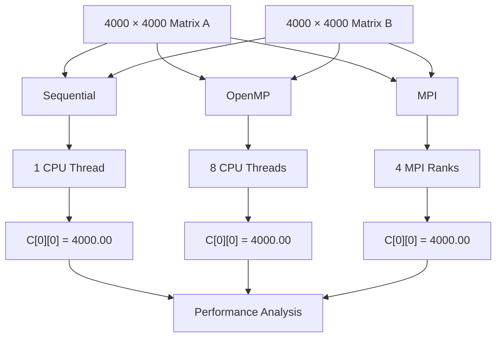
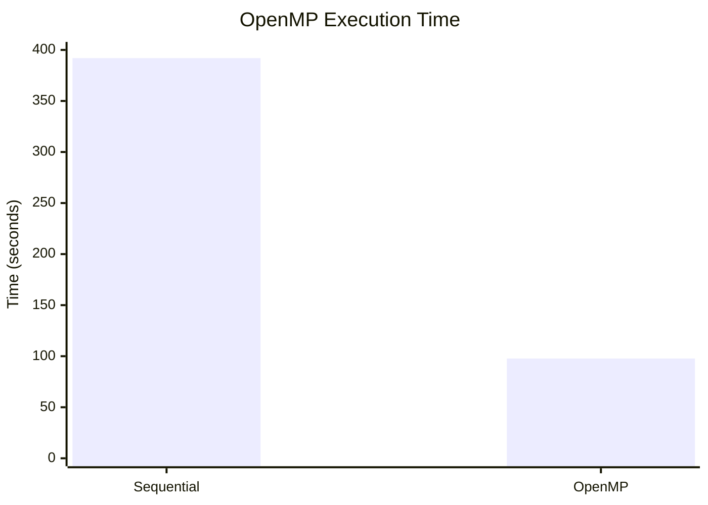

# 🚀 Matrix Multiplication — OpenMP & MPI Parallel Computing

This repository demonstrates the implementation and performance evaluation of **matrix multiplication** using three different computing approaches:

* **Sequential CPU execution**
* **OpenMP shared-memory parallel processing**
* **MPI distributed-memory parallel processing**

The experiment uses **4000×4000 matrices** and demonstrates how parallel computing techniques can reduce execution time for computationally intensive matrix multiplication.

The project evaluates execution time, speedup, parallel efficiency, and correctness while demonstrating two major parallel programming models:

> **OpenMP → Shared-memory parallelism**
> **MPI → Distributed-memory/message-passing parallelism**

---

## 📊 Highlight Results

### OpenMP

> OpenMP reduced the execution time from **391.980118 seconds to 97.720623 seconds**, achieving a **4.011× speedup** using 8 CPU threads while producing the correct result `C[0][0] = 4000.00`.

| Implementation |   Execution Time |    Speedup | Threads |
| -------------- | ---------------: | ---------: | ------: |
| Sequential     | **391.980118 s** | **1.000×** |       1 |
| OpenMP         |  **97.720623 s** | **4.011×** |       8 |

**Runtime Reduction:** 75.1%
**Parallel Efficiency:** 50.1%

### MPI

The MPI implementation used **4 MPI processes/ranks**.

| Implementation | Execution Time |    Speedup | Processes |
| -------------- | -------------: | ---------: | --------: |
| Sequential*    |  **244.120 s** | **1.000×** |         1 |
| MPI            |   **92.980 s** |  **2.63×** |         4 |

*The MPI benchmark was measured in an earlier experiment using its corresponding sequential baseline of 244.120 seconds. Therefore, the MPI and OpenMP timing results should be treated as separate benchmark runs rather than a direct head-to-head comparison.

---

# 📑 Table of Contents

1. [Project Overview](#1-project-overview)
2. [Objectives](#2-objectives)
3. [Parallel Computing Models](#3-parallel-computing-models)
4. [Architecture Overview](#4-architecture-overview)
5. [Workload Description](#5-workload-description)
6. [Repository Structure](#6-repository-structure)
7. [Sequential Implementation](#7-sequential-implementation)
8. [OpenMP Implementation](#8-openmp-implementation)
9. [MPI Implementation](#9-mpi-implementation)
10. [How OpenMP Works](#10-how-openmp-works)
11. [How MPI Works](#11-how-mpi-works)
12. [How to Compile and Run](#12-how-to-compile-and-run)
13. [Experimental Results](#13-experimental-results)
14. [Performance Analysis](#14-performance-analysis)
15. [Performance Metrics](#15-performance-metrics)
16. [OpenMP vs MPI](#16-openmp-vs-mpi)
17. [Factors Affecting Performance](#17-factors-affecting-performance)
18. [Key Concepts Demonstrated](#18-key-concepts-demonstrated)
19. [Conclusion](#19-conclusion)
20. [Technologies Used](#20-technologies-used)

---

# 1. Project Overview

Matrix multiplication is a computationally intensive operation widely used in:

* Machine Learning
* Computer Graphics
* Scientific Computing
* Image Processing
* Numerical Simulation
* Data Analytics
* Engineering Simulations

For two matrices:

$$
C = A \times B
$$

each element of matrix `C` is calculated as:

$$
C[i][j] = \sum_{k=0}^{N-1} A[i][k] \times B[k][j]
$$

A traditional sequential implementation performs these operations one after another.

This project explores how the same workload can be accelerated using:

### Sequential

A single CPU thread performs the complete computation.

### OpenMP

Multiple CPU threads execute different loop iterations concurrently using shared memory.

### MPI

Multiple independent processes/ranks communicate and distribute portions of the matrix computation using message passing.

---

# 2. Objectives

### 🎯 Primary Objectives

1. Implement matrix multiplication using a **sequential CPU approach**.
2. Implement matrix multiplication using **OpenMP**.
3. Implement matrix multiplication using **MPI**.
4. Execute the OpenMP workload using **8 CPU threads**.
5. Execute the MPI workload using **4 MPI ranks**.
6. Compare execution times.
7. Calculate speedup.
8. Calculate parallel efficiency.
9. Verify correctness of the parallel implementations.
10. Understand the difference between **shared-memory and distributed-memory parallelism**.
11. Understand communication operations such as `MPI_Scatter`, `MPI_Bcast`, and `MPI_Gather`.

---

# 3. Parallel Computing Models

This project demonstrates two major parallel programming models.

| Model      | Parallelism        | Communication           | Processing Units |
| ---------- | ------------------ | ----------------------- | ---------------- |
| Sequential | None               | Not required            | 1 CPU thread     |
| OpenMP     | Shared-memory      | Shared variables/memory | 8 threads        |
| MPI        | Distributed-memory | Message passing         | 4 MPI ranks      |

### OpenMP

```text
Single Process
      │
      ├── Thread 1
      ├── Thread 2
      ├── Thread 3
      ├── ...
      └── Thread 8

        Shared Memory
```

### MPI

```text
MPI Program
     │
     ├── Rank 0
     ├── Rank 1
     ├── Rank 2
     └── Rank 3

  Message Passing
       ↕
MPI Communication
```

---

# 4. Architecture Overview



---

# 5. Workload Description

The matrix multiplication workload uses:

| Parameter      | Value         |
| -------------- | ------------- |
| Matrix A       | `4000 × 4000` |
| Matrix B       | `4000 × 4000` |
| Matrix C       | `4000 × 4000` |
| A elements     | `1.0`         |
| B elements     | `1.0`         |
| Data type      | `double`      |
| Operation      | `C = A × B`   |
| OpenMP threads | `8`           |
| MPI ranks      | `4`           |

Since every element of both input matrices is `1.0`:

$$
C[i][j] =
\sum_{k=0}^{3999}(1.0 \times 1.0)
$$

Therefore:

$$
C[i][j] = 4000
$$

### Verification

```text
C[0][0] = 4000.00
```

The expected result is therefore `4000.00` for every element of matrix `C`.

---

# 6. Repository Structure

```text
openmp-mpi-matrix-multiplication/
│
├── baseline/
│   └── src/
│       └── matrix_sequential.c
│
├── optimized/
│   └── src/
│       └── matrix_openmp.c
│
├── mpi/
│   └── src/
│       └── matrix_mpi.c
│
├── advanced/
│   └── ...
│
├── benchmarks/
│   └── ...
│
├── screenshots/
│   ├── sequential_result.png
│   ├── openmp_result.png
│   ├── openmp_htop.png
│   └── mpi_result.png
│
├── Makefile
├── README.md
└── ...
```

### Source Files

| Implementation | File                               | Description                                  |
| -------------- | ---------------------------------- | -------------------------------------------- |
| Sequential     | `baseline/src/matrix_sequential.c` | Single-threaded matrix multiplication        |
| OpenMP         | `optimized/src/matrix_openmp.c`    | Shared-memory parallel matrix multiplication |
| MPI            | `mpi/src/matrix_mpi.c`             | Distributed-memory matrix multiplication     |
| Advanced       | `advanced/`                        | Further optimization experiments             |
| Benchmarks     | `benchmarks/`                      | Performance measurements and analysis        |

---

# 7. Sequential Implementation

The sequential implementation uses the conventional **triple-nested loop**:

```c
for (i = 0; i < N; i++) {
    for (j = 0; j < N; j++) {
        for (k = 0; k < N; k++) {
            C[i][j] += A[i][k] * B[k][j];
        }
    }
}
```

### Working

For every element `C[i][j]`:

1. Select a row from matrix `A`.
2. Select a column from matrix `B`.
3. Multiply corresponding elements.
4. Add the products.
5. Store the result in `C[i][j]`.

### Complexity

Matrix multiplication requires:

$$
O(N^3)
$$

operations.

For `N = 4000`, this creates a very large computational workload, making the problem suitable for parallel computing.

---

# 8. OpenMP Implementation

The OpenMP version parallelizes the outer loop.

```c
#pragma omp parallel for
for (i = 0; i < N; i++) {
    for (j = 0; j < N; j++) {
        for (k = 0; k < N; k++) {
            C[i][j] += A[i][k] * B[k][j];
        }
    }
}
```

### Key OpenMP Directive

```c
#pragma omp parallel for
```

This tells OpenMP to:

* Create a parallel region.
* Divide loop iterations among threads.
* Execute iterations concurrently.
* Synchronize threads after the loop.

### OpenMP Configuration

```bash
export OMP_NUM_THREADS=8
```

The experiment uses:

```text
8 CPU threads
```

---

# 9. MPI Implementation

The MPI implementation uses **4 MPI ranks/processes** to divide the matrix multiplication workload.

Unlike OpenMP, MPI does not rely on multiple threads sharing the same memory space. Each MPI process has its own memory space and communicates with other processes using MPI communication functions.

## MPI Workflow

The implementation follows:

```text
MPI_Scatter(A)
       ↓
MPI_Bcast(B)
       ↓
Local Matrix Multiplication
       ↓
MPI_Gather(C)
       ↓
Final Matrix C
```

### Step 1 — MPI Initialization

The MPI environment is initialized using:

```c
MPI_Init(...)
```

Each process obtains its:

* Rank
* Total number of processes

using:

```c
MPI_Comm_rank(...)
MPI_Comm_size(...)
```

---

## Step 2 — Distribute Matrix A

Matrix `A` is divided among the MPI ranks using:

```c
MPI_Scatter()
```

For a `4000 × 4000` matrix and 4 MPI ranks:

```text
4000 rows / 4 ranks
        ↓
1000 rows per rank
```

Therefore:

```text
Rank 0 → 1000 rows
Rank 1 → 1000 rows
Rank 2 → 1000 rows
Rank 3 → 1000 rows
```

---

## Step 3 — Broadcast Matrix B

Every MPI rank requires the complete matrix `B`.

Therefore, matrix `B` is distributed to all ranks using:

```c
MPI_Bcast()
```

Conceptually:

```text
              Matrix B
                 │
       ┌─────────┼─────────┐
       ↓         ↓         ↓
    Rank 0     Rank 1    Rank 2    Rank 3
       │         │         │         │
       └─────────┴─────────┴─────────┘
```

Each rank now has:

```text
Its portion of A
+
Complete B
```

---

## Step 4 — Local Computation

Each rank independently calculates its portion of matrix `C`.

For example:

```text
Rank 0 → C rows 0–999
Rank 1 → C rows 1000–1999
Rank 2 → C rows 2000–2999
Rank 3 → C rows 3000–3999
```

Each rank performs:

$$
C_{local} = A_{local} \times B
$$

---

## Step 5 — Gather Results

After local computation, the partial results are combined using:

```c
MPI_Gather()
```

The root process collects the computed portions and reconstructs the complete matrix `C`.

```text
Rank 0 ──┐
Rank 1 ──┤
Rank 2 ──┼──→ MPI_Gather → Complete Matrix C
Rank 3 ──┘
```

---

# 10. How OpenMP Works

OpenMP uses a **shared-memory model**.

```text
              Single Process
                    │
        ┌───────────┼───────────┐
        ↓           ↓           ↓
      Thread 1    Thread 2    Thread 3
        ↓           ↓           ↓
       Rows        Rows        Rows
        │           │           │
        └───────────┼───────────┘
                    ↓
              Shared Matrix C
```

All threads belong to the same process and can access shared memory.

### Main Characteristics

* Thread-based parallelism
* Shared memory
* Easy loop parallelization
* Low communication complexity
* Suitable for multicore systems

---

# 11. How MPI Works

MPI uses a **distributed-memory/message-passing model**.

```text
                 MPI Program
                     │
       ┌─────────────┼─────────────┐
       ↓             ↓             ↓
    Rank 0         Rank 1        Rank 2       Rank 3
       │             │             │            │
       └─────────────┼─────────────┘
                     │
              Message Passing
```

Each process has its own address space.

Processes communicate using MPI functions such as:

```text
MPI_Scatter()
MPI_Bcast()
MPI_Gather()
```

### Main Characteristics

* Process-based parallelism
* Distributed memory
* Explicit communication
* Scalable across multiple machines
* Suitable for clusters and distributed systems

---

# 12. How to Compile and Run

## Prerequisites

The experiment uses:

* Ubuntu / WSL
* GCC
* OpenMP
* MPI
* Make
* Git & GitHub

---

## Compile Sequential Version

Navigate to:

```bash
cd baseline/src
```

Compile:

```bash
gcc matrix_sequential.c -o matrix_sequential
```

Run:

```bash
./matrix_sequential
```

---

## Compile OpenMP Version

Navigate to:

```bash
cd optimized/src
```

Compile:

```bash
gcc -fopenmp matrix_openmp.c -o matrix_openmp
```

Run:

```bash
export OMP_NUM_THREADS=8
./matrix_openmp
```

---

## Compile MPI Version

Navigate to:

```bash
cd mpi/src
```

Compile using the MPI compiler:

```bash
mpicc matrix_mpi.c -o matrix_mpi
```

Run using 4 MPI processes:

```bash
mpirun -np 4 ./matrix_mpi
```

or:

```bash
mpiexec -np 4 ./matrix_mpi
```

### MPI Process Configuration

```text
Number of MPI ranks = 4

4000 rows / 4 ranks = 1000 rows per rank
```

---

# 13. Experimental Results

## 13.1 Sequential Result

The sequential implementation was executed using a single CPU thread.

```text
Matrix Size: 4000 × 4000

Execution Time: 391.980118 seconds

C[0][0] = 4000.00
```

---

## 13.2 OpenMP Result

The OpenMP implementation was executed using 8 CPU threads.

```text
Matrix Size: 4000 × 4000
Threads: 8

Execution Time: 97.720623 seconds

C[0][0] = 4000.00
```

### OpenMP Performance

```text
Sequential : 391.980118 s
OpenMP     : 97.720623 s

Speedup    : 4.011×
Efficiency : 50.1%
Reduction  : 75.1%
```

---

## 13.3 MPI Result

The MPI implementation was executed using 4 MPI ranks.

```text
Matrix Size: 4000 × 4000
MPI Ranks: 4

Execution Time: 92.980 seconds

C[0][0] = 4000.00
```

The MPI experiment achieved:

```text
Speedup    : 2.63×
```

using its corresponding sequential benchmark of:

```text
244.120 seconds
```

---

# 14. Performance Analysis

## OpenMP Performance

| Metric            |   Sequential |      OpenMP |
| ----------------- | -----------: | ----------: |
| Matrix Size       |    4000×4000 |   4000×4000 |
| Threads           |            1 |           8 |
| Execution Time    | 391.980118 s | 97.720623 s |
| Speedup           |       1.000× |      4.011× |
| Runtime Reduction |            — |       75.1% |
| Efficiency        |            — |       50.1% |
| `C[0][0]`         |      4000.00 |     4000.00 |

---

## MPI Performance

| Metric         | Sequential* |       MPI |
| -------------- | ----------: | --------: |
| Matrix Size    |   4000×4000 | 4000×4000 |
| Processes      |           1 |         4 |
| Execution Time |   244.120 s |  92.980 s |
| Speedup        |      1.000× |     2.63× |
| `C[0][0]`      |     4000.00 |   4000.00 |

*MPI benchmark baseline from the earlier MPI experiment.

---

## Execution Time Concept



The OpenMP implementation substantially reduces the wall-clock execution time by distributing loop iterations among multiple CPU threads.

---

# 15. Performance Metrics

## 15.1 Speedup

Speedup measures how much faster a parallel implementation performs compared with its sequential baseline.

$$
Speedup =
\frac{T_s}{T_p}
$$

where:

* `Ts` = sequential execution time
* `Tp` = parallel execution time

### OpenMP

$$
Speedup =
\frac{391.980118}{97.720623}
$$

$$
\boxed{Speedup \approx 4.011\times}
$$

### MPI

Using the MPI experiment's corresponding sequential baseline:

$$
Speedup =
\frac{244.120}{92.980}
$$

$$
\boxed{Speedup \approx 2.63\times}
$$

---

# 16. OpenMP vs MPI

OpenMP and MPI both provide parallelism, but they use fundamentally different approaches.

| Feature                | OpenMP                      | MPI                         |
| ---------------------- | --------------------------- | --------------------------- |
| Parallel unit          | Thread                      | Process / Rank              |
| Memory model           | Shared memory               | Distributed memory          |
| Communication          | Shared variables            | Message passing             |
| Main API               | OpenMP directives           | MPI functions               |
| Example                | `#pragma omp parallel for`  | `MPI_Scatter()`             |
| Execution              | Usually within one system   | Can span multiple systems   |
| Memory                 | Shared address space        | Separate address spaces     |
| Scalability            | Primarily multicore systems | Highly scalable clusters    |
| Programming complexity | Relatively simpler          | More explicit communication |

---

## OpenMP Workflow

```text
Matrix A + Matrix B
        │
        ↓
   Shared Memory
        │
 ┌──────┼──────┐
 ↓      ↓      ↓
T1     T2     T3 ... T8
 │      │      │
 └──────┼──────┘
        ↓
    Matrix C
```

---

## MPI Workflow

```text
              Matrix A
                 │
          MPI_Scatter
                 │
     ┌───────────┼───────────┐
     ↓           ↓           ↓
   Rank 0      Rank 1      Rank 2      Rank 3
 1000 rows   1000 rows   1000 rows   1000 rows
     │           │           │           │
     └───────────┼───────────┘
                 │
          MPI_Bcast(B)
                 │
          Local Computation
                 │
          MPI_Gather(C)
                 ↓
            Matrix C
```

---

# 17. Factors Affecting Performance

The measured speedup does not necessarily reach the theoretical number of threads or processes.

Several factors affect performance.

### 1. Thread/Process Management Overhead

Creating, scheduling, and managing parallel workers introduces overhead.

### 2. Communication Overhead

MPI requires explicit communication between processes.

Operations such as:

```text
MPI_Scatter
MPI_Bcast
MPI_Gather
```

take time.

### 3. Memory Access

Matrix multiplication performs a large number of memory accesses.

Performance can therefore depend on:

* CPU cache
* Memory bandwidth
* Cache locality
* Memory latency

### 4. Synchronization

Parallel workers may need synchronization before proceeding.

### 5. Hardware Limitations

Performance depends on:

* Number of CPU cores
* Number of logical processors
* CPU architecture
* Cache size
* Memory bandwidth
* Operating-system scheduling

### 6. Non-Parallel Work

According to Amdahl's Law, portions of the program that cannot be parallelized limit the maximum possible speedup.

---

# 18. Key Concepts Demonstrated

This project demonstrates:

* ✅ Sequential computation
* ✅ Parallel computing
* ✅ Shared-memory parallelism
* ✅ Distributed-memory parallelism
* ✅ OpenMP
* ✅ MPI
* ✅ CPU multithreading
* ✅ MPI processes/ranks
* ✅ Loop parallelization
* ✅ Message passing
* ✅ `MPI_Scatter`
* ✅ `MPI_Bcast`
* ✅ `MPI_Gather`
* ✅ Thread scheduling
* ✅ Matrix multiplication
* ✅ Speedup calculation
* ✅ Parallel efficiency
* ✅ Performance benchmarking
* ✅ Correctness verification

---

# 19. Conclusion

This project demonstrates how parallel computing can accelerate computationally intensive matrix multiplication using both **OpenMP** and **MPI**.

For the OpenMP experiment:

```text
Matrix Size : 4000 × 4000
Threads     : 8

Sequential : 391.980118 s
OpenMP     : 97.720623 s

Speedup    : 4.011×
Reduction  : 75.1%
Efficiency : 50.1%
```

For the MPI experiment:

```text
Matrix Size : 4000 × 4000
MPI Ranks   : 4

MPI Time   : 92.980 s
Speedup    : 2.63×
```

The MPI implementation distributes the matrix rows among four ranks:

```text
4000 rows
    ↓
4 MPI ranks
    ↓
1000 rows/rank
```

The computation follows:

```text
MPI_Scatter(A)
       ↓
MPI_Bcast(B)
       ↓
Local Matrix Multiplication
       ↓
MPI_Gather(C)
```

Both parallel approaches maintain computational correctness, producing:

```text
C[0][0] = 4000.00
```

The project therefore demonstrates two fundamental approaches to parallel computing:

> **OpenMP — shared-memory, thread-based parallelism**

and

> **MPI — distributed-memory, process-based message passing**

---

# 20. Technologies Used

* **C**
* **OpenMP**
* **MPI**
* **GCC 13.3.0**
* **Open MPI / MPI**
* **Ubuntu / WSL**
* **Make**
* **Git**
* **GitHub**

---

## 👨‍💻 Project

### Parallel Computing Laboratory — Matrix Multiplication

```text
                  Matrix Multiplication
                           │
              ┌────────────┼────────────┐
              ↓            ↓            ↓
          Sequential     OpenMP        MPI
              │            │            │
           1 Thread     8 Threads    4 Ranks
              │            │            │
              ↓            ↓            ↓
          Baseline    Shared Memory  Message Passing
              │            │            │
              └────────────┼────────────┘
                           ↓
                  Performance Analysis
                           │
              ┌────────────┼────────────┐
              ↓            ↓            ↓
           Runtime       Speedup     Efficiency
```

⭐ **If you found this project useful, consider giving the repository a star!**
